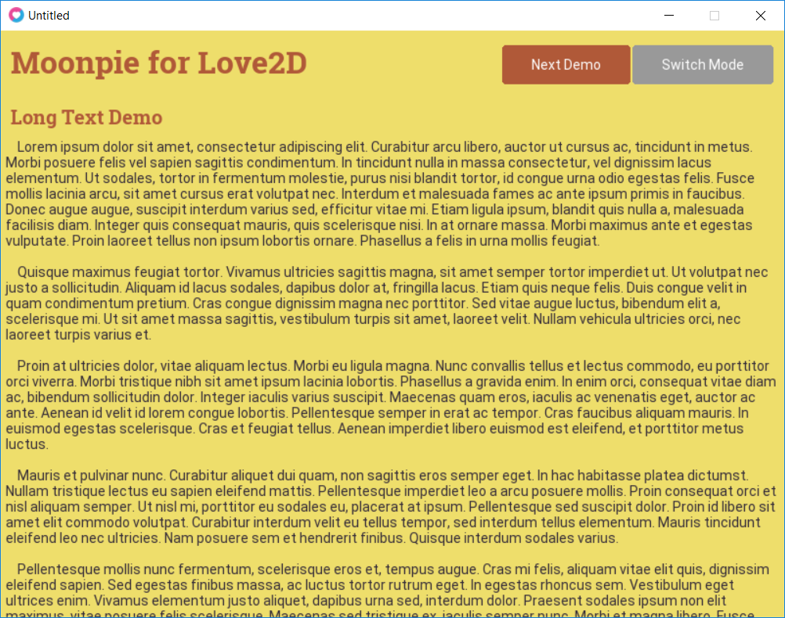
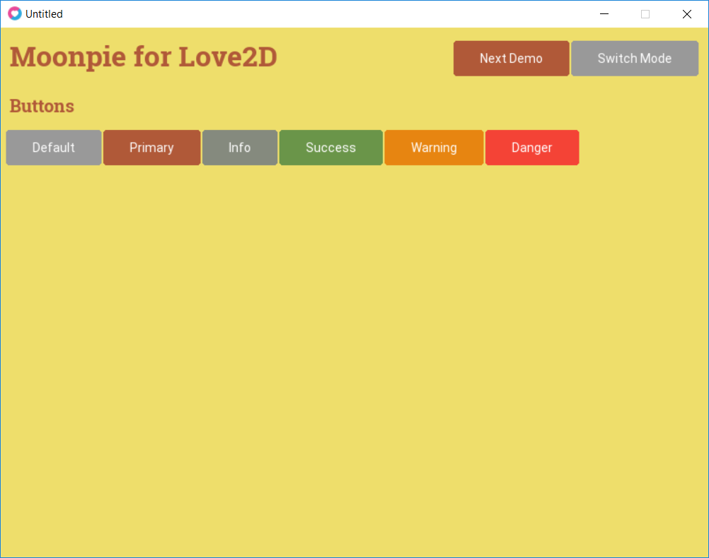

# moonpie
Dynamic Layout UI Library for UI with Tests

## Motivation

After reviewing some other GUI libraries out there for Love2D, I realized I should not write another one. 
Sadly, I could not resist. After thinking about how browsers and libraries like React and others
work with UI/UX, I thought that maybe there was an opportunity to design something like that for Love2d.

The goal is to make a UI library that is easy to customize the presentation, but more importantly,
easy to start building UI's while prototyping games. I get frustrated having to set positions of things,
of figuring out how to wire up events. I didn't like the effort needed to move things around.

## Goals
 * 100% Unit Test Coverage
 * Easy to adjust layout as needed
 * Layout without specifying every pixel
 * Layout is dynamic to different screen sizes
 * Handling user input is intuitive and testable

## Current Screenshots
<<<<<<< HEAD

=======

>>>>>>> 9b4273627f74a96b98d655080da8dd95024b9706

