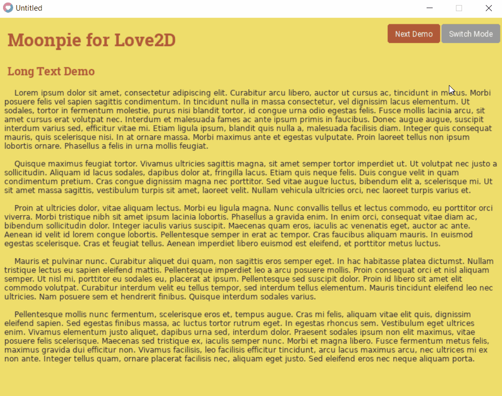

[](https://coveralls.io/github/tredfern/moonpie?branch=master)
[](http://love2d.org/)

# Moonpie - A Comprehensive Framework for Love2D
Moonpie combines a _React-style Component UI,_
_Redux-style store/state management system, and robust suite of utilities_ to assist in building Love2D games.

## Why?
[Love2D](http://love2d.org) is _FANTASTIC_!. It allows for a lot of flexibility in how you approach development. Combined with the focus on Lua, a language the grants a lot of power to programmers to define their structure, there are limitless ways to build and organize your Love2D projects.

That flexibility opened the possibility to explore the question, _could game applications be structured similar to traditional enterprise applications?_

Moonpie is an attempt to answer that by:
* Providing a UI framework that allows for responsive-style modular components
* A state management system with events
* Utilities that allow for expressive coding
* An emphasis on unit-testable components
* 

### But will it blend?
I cannot say Moonpie is ready for large-scale projects. At this time, I'm actively using it in my own personal project and I am not disappointed. 

It can demonstrate some very interesting approaches that at least for complex-rule intensive games provides the structure necessary to manage the code.

---
## Features
### UI Components

UI components are reusable blocks of code that represent the controls on the screen. 

```lua
local moonpie = require "moonpie"

-- Define a new component
local title = moonpie.ui.components(
  "title", -- Name for the component
  function(props) -- Render function that defines what the component displays
    -- Returns a table that represents the component
    return { 
      -- Index elements inside the table define what to render
      moonpie.ui.components.h1({ text = props.title_text }),
      moonpie.ui.components.hr()
    }
  end
)

-- Tell moonpie to render this out with the text being "Hello World"
moonpie.render(title({ title_text = "Hello World" }))
```
### Additional Features

**Styling** 

There are two main ways that you can style a component and it is modeled after HTML's implementation. Styles can be configured in a stylesheet to provide access globally or specific style properties can be passed to a component on construction.

```lua
local styles = require "moonpie.ui.styles"
styles.title = {
  margin = 5, -- will add margin of 5 pixels on all sides
  padding = { left = 2, right = 10, top = 3, bottom = 5 }, -- padding and margin can be specified on each side
  backgroundColor = { 1, 1, 1, 1 },
}

styles.custom = {
  color = { 0, 0, 0, 1 }
}

moonpie.render(title({ styles = "custom", title_text = "Styled!" }))
-- Will first pull the custom style
-- And then pull the "title" style since the name of the component matches
```

### Store

The store is modeled after Redux.
1. Actions that are basic tables define how state should change
2. Actions are dispatched to the store
3. Store calls the reducer to handle the action
4. Reducer returns an updated state


```lua
local action = {
  type = "TODO_ADD",
  payload = {
    todo = "Write more code"
  }
}

local reducer = function(state, action)
  if action.type == "TODO_ADD" then
    table.insert(state.todos, action.payload.todo)
  end
end

local store = require "moonpie.state.store"
store.createStore(reducer, { todos = {} })
store.dispatch(action)
local state = store.getState()
print(state.todos[1])
-- "Write more code"
```

### Additional Functionality

**Slices** - To help segment state, reducers can be combined. A routine for creating slices helps handle the basic logic to process actions.

**Thunks** - Dispatching callable tables or functions can be used to handle complex actions. When a function is dispatched it will be called by the store with a dispatch parameter to process complex action sequences.

**Subscribing** - Whenever the state is updated it will trigger event listeners. It is possible to listen for specific actions as well as general updates whenever the state changes.

**Connect to UI** - There is a helper to connect the UI to changes in state. This makes it possible to update UI components in response to UI changes.

## Advanced Uses

* Components should be broken down like React Components
* Components will not refresh unless specified to update
* Consider what level components should update, what is the
  appropriate place to manage state?

## What about IMGUI, or other options?

**IMGUI** - Any implementation for UI or Framework needs to make tradeoffs. IMGUI's are great for eliminating the need to track state within components. Moonpie doesn't try to compete in that style of implementation. Moonpie does provide the ability to create highly-modular, reusable bits of UI logic with state properly managed and encapsulated in a store. This makes it testable and the responsive layout behavior can be a great win for quick prototyping projects.

**Window Style** - Another common pattern in game GUI libraries is an implementation like Windows with different GUI elements in a hierarchy that can be moved around. I have written several implementations of this kind of UI in the past and I find them to be problematic when using new resolutions. I also felt there was a lot of code to configure these properly. Moonpie tries to keep that configuration logic to a minimum. And by removing the window style implementation it frees up thinking about what components are displaying/doing as opposed to how they should look.


## Goals
 * 100% Unit Test Coverage
 * Game framework that allows rapid development
 * Easy to adjust layout as needed
 * Layout without specifying every pixel
 * Layout is dynamic to different screen sizes
 * Handling user input is intuitive and testable
 * Organize code that allows separation of concerns

## Demo


## Acknowledgments 
### Game Icons
The entire game icons library has been imported into this project. I attempted to do this in a way that will allow
it to be easily updated and maintained. Please visit game-icons.net for the complete information about this 
fantastic project. Specific license for the icons is located in the moonpie/assets/icons folder.

All icons are created by the following authors:
- Lorc, http://lorcblog.blogspot.com
- Delapouite, https://delapouite.com
- John Colburn, http://ninmunanmu.com
- Felbrigg, http://blackdogofdoom.blogspot.co.uk
- John Redman, http://www.uniquedicetowers.com
- Carl Olsen, https://twitter.com/unstoppableCarl
- Sbed, http://opengameart.org/content/95-game-icons
- PriorBlue
- Willdabeast, http://wjbstories.blogspot.com
- Viscious Speed, http://viscious-speed.deviantart.com - CC0
- Lord Berandas, http://berandas.deviantart.com
- Irongamer, http://ecesisllc.wix.com/home
- HeavenlyDog, http://www.gnomosygoblins.blogspot.com
- Lucas
- Faithtoken, http://fungustoken.deviantart.com
- Skoll
- Andy Meneely, http://www.se.rit.edu/~andy/
- Cathelineau
- Kier Heyl
- Aussiesim
- Sparker, http://citizenparker.com
- Zeromancer - CC0
- Rihlsul
- Quoting
- Guard13007, https://guard13007.com
- DarkZaitzev, http://darkzaitzev.deviantart.com
- SpencerDub
- GeneralAce135
- Zajkonur
- Catsu
- Starseeker
- Pepijn Poolman
- Pierre Leducq
