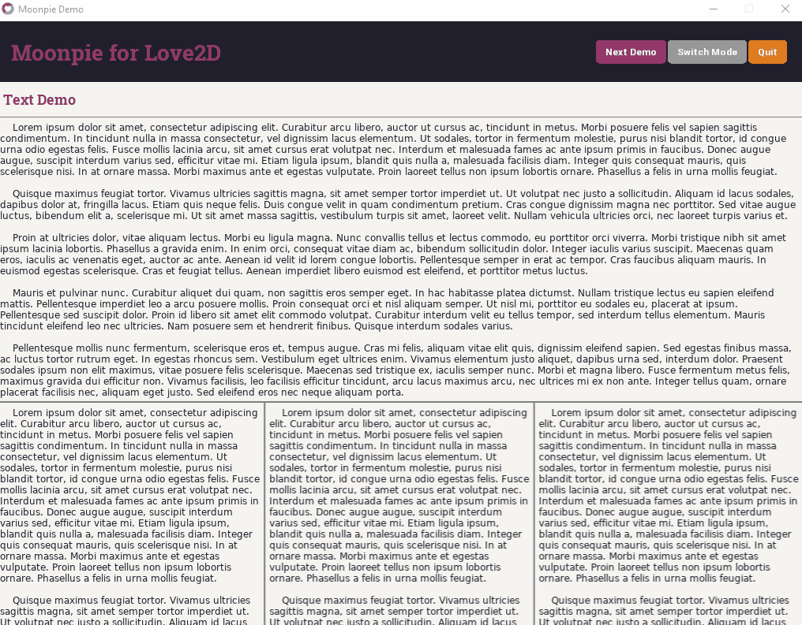

[](https://travis-ci.org/tredfern/moonpie)
[](https://coveralls.io/github/tredfern/moonpie?branch=master)
[](http://love2d.org/)

# moonpie
Dynamic Layout UI Library with Tests

## Motivation

Most GUI libraries seem to be focused heavily on framing controls. There is usually some container functionality
followed by a group of widgets and then it feels left on your own to make them work. There doesn't appear
to be an intentional design focused on providing an easy and logical way to organize your controls, code
or to provide unit testing for them. _I have not done an extensive assessment of all libraries out there._
I could certainly be wrong. However, when I looked at things like Immediate Mode UI's and other libraries
created, they feel focused on the controls and not on the user.

Controls just provide the basic twiddles to make something happen, it's the coordination of those controls
that makes a UI. Moonpie is an attempt to take what I have learned building web applications and apply
it to a game framework. The component framework is designed to allow it easier to organize, test, and reuse
widgets of code. The layout engine is designed to make it easy to place them on the screen logically and
take the burden of worrying about each pixel. The eventing is designed to take advantage of the functional
language of Lua. The preference to avoid state is to reduce the amount of management needed for the UI.

The demo provided shows some of the basic controls and widgets, but more importantly it should show that
writing the code that does some interesting layouts of controls is easy and intuitive. The debug tools
are built in the same framework and could be extended to support each individual game project.

## Layouts

Layouts are defined by nested tables. Think of a plain table as representing a DIV tag with no styles.
This allows common elements to be grouped together easily.

Width and height can be specified to the element to set it's area, but best is to be like HTML and define
sizes sparingly. Text elements will calculate their size based on the amount of text and the max width available.
Images will scale to specified sizes.

The outcome is that each element defined in the layout becomes a node in the layout tree. Style information
is merged into the style tree to provide reusable properties that should be consistent. Properties specified
directly onto the table will override style properties. If the element is a reusable Component, then it will
also include style information that matches the Component name. A few parent element properties are inherited
as well.

## Rendering

Rendering is performed by traversing the tree and then rendering, if appropriate:
 1. The element's background
 1. The element's border
 1. The element's children
 1. The element's image

## Components

Components are the reusable bits of logic. All the controls are based on components. The idea is to compose
more complex components by combining the features of more simple ones. Components are defined by creating
functions that define the behavior to return the appropriate table element to represent a new version of that
component.

## Keyboard

Moonpie supports adding hotkeys that can trigger callbacks.

```
  moonpie.keyboard:hotkey("escape", function() ... end)
```

## Challenges / Changes / Ideas / Todo

 1. Reduce the amount of work by using canvases to handle elements that are not changing
 1. Every index lookup into a node is recomputing the styles and then returning the key. 
  This is because each update the style could have changed (mouse hover for example). But
  within a frame it should not. Precomputing styles could reduce burden of the engine.
 1. Should be able to remove a component completely from the render tree.

## Goals
 * 100% Unit Test Coverage
 * Easy to adjust layout as needed
 * Layout without specifying every pixel
 * Layout is dynamic to different screen sizes
 * Handling user input is intuitive and testable

## Demo


## Acknowledgments 
### Game Icons
The entire game icons library has been imported into this project. I attempted to do this in a way that will allow
it to be easily updated and maintained. Please visit game-icons.net for the complete information about this 
fantastic project. Specific license for the icons is located in the moonpie/assets/icons folder.

All icons are created by the following authors:
- Lorc, http://lorcblog.blogspot.com
- Delapouite, https://delapouite.com
- John Colburn, http://ninmunanmu.com
- Felbrigg, http://blackdogofdoom.blogspot.co.uk
- John Redman, http://www.uniquedicetowers.com
- Carl Olsen, https://twitter.com/unstoppableCarl
- Sbed, http://opengameart.org/content/95-game-icons
- PriorBlue
- Willdabeast, http://wjbstories.blogspot.com
- Viscious Speed, http://viscious-speed.deviantart.com - CC0
- Lord Berandas, http://berandas.deviantart.com
- Irongamer, http://ecesisllc.wix.com/home
- HeavenlyDog, http://www.gnomosygoblins.blogspot.com
- Lucas
- Faithtoken, http://fungustoken.deviantart.com
- Skoll
- Andy Meneely, http://www.se.rit.edu/~andy/
- Cathelineau
- Kier Heyl
- Aussiesim
- Sparker, http://citizenparker.com
- Zeromancer - CC0
- Rihlsul
- Quoting
- Guard13007, https://guard13007.com
- DarkZaitzev, http://darkzaitzev.deviantart.com
- SpencerDub
- GeneralAce135
- Zajkonur
- Catsu
- Starseeker
- Pepijn Poolman
- Pierre Leducq
