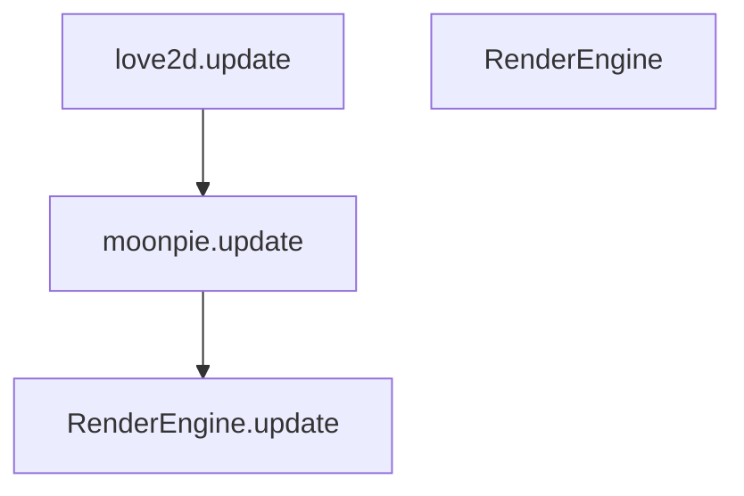

# Render Engine Logic


### Update Sequence
```
love.update
moonpie.update
RenderEngine.update(mouse)
    
foreach layer
    
  layer.update(mouse)
    - mouse.update(layer.root)

    if renderengine.update_node(layer.root) then
      root.layout()
```

?? Can the layer be turned into just a node?
?? Can we drop the names and just use numbers for the layers


3 main pieces
RenderEngine, Layers, and Nodes

